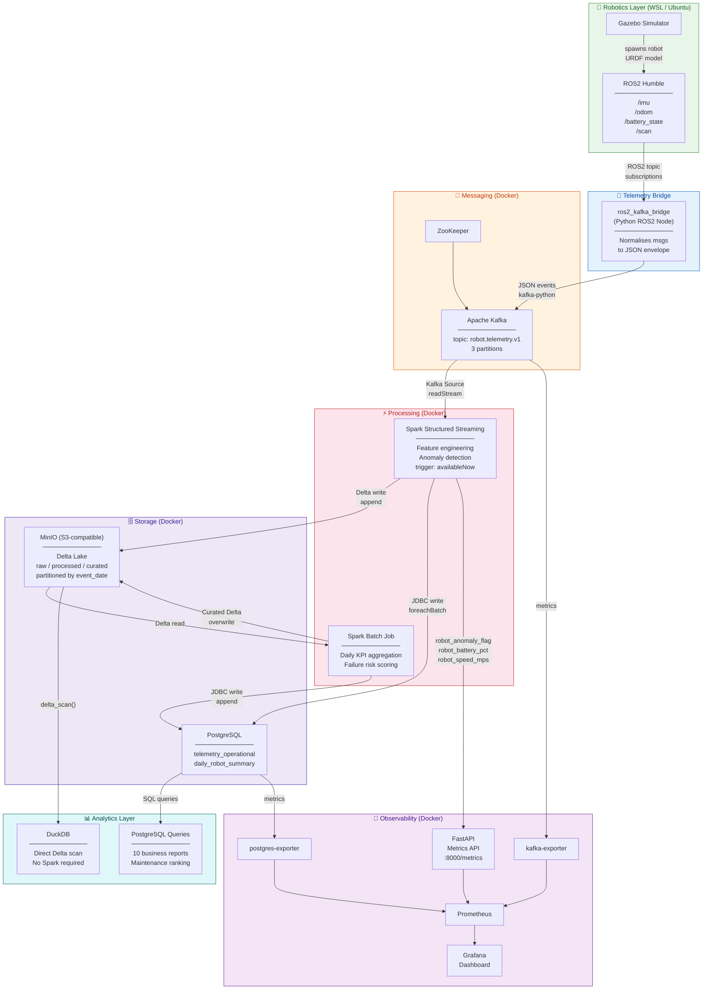

# Robot Telemetry Data Platform

Production-style local robotics data engineering project using ROS2, Gazebo, Kafka, Spark, Delta Lake, MinIO, PostgreSQL, Prometheus, and Grafana.

## Architecture



## Data flow summary

```
Robot (Gazebo/ROS2)
  └─ /imu, /odom, /battery_state, /scan topics
       └─ ros2_kafka_bridge  ──►  Kafka (robot.telemetry.v1)
                                        │
                          ┌─────────────┘
                          ▼
                  Spark Structured Streaming
                  ├─ Feature engineering  (speed_mps, battery_degradation_score)
                  ├─ Anomaly detection    (speed > 2.5 m/s │ battery < 15% │ distance < 0.2 m)
                  ├─ Delta Lake → MinIO   s3://robot-lake/processed/telemetry_events/
                  └─ PostgreSQL           telemetry_operational
                          │
                          ▼
                  Spark Batch (daily)
                  ├─ KPI aggregation      (avg speed, min battery, anomaly count)
                  ├─ Failure risk flag    (anomaly_events > 10)
                  ├─ Delta Lake → MinIO   s3://robot-lake/curated/daily_robot_summary/
                  └─ PostgreSQL           daily_robot_summary
                          │
                  ┌───────┴──────────┐
                  ▼                  ▼
            DuckDB                PostgreSQL
            (7 analytical         (10 business
             reports on            SQL reports)
             Delta files)
```

## Current status
- ✅ Stage 3 bootstrap scaffold created
- ✅ Stage 4 ROS2 + Gazebo implementation created
- ✅ Stage 5 ROS2 → Kafka bridge implemented
- ✅ Stage 6 Docker Compose infrastructure implemented
- ✅ Stage 7 Spark Structured Streaming implemented
- ✅ Stage 8 Data Lake design and partition strategy completed
- ✅ Stage 9 Batch aggregation job implemented
- ✅ Stage 10 Observability and monitoring API implemented
- ✅ Stage 11 Analytics layer implemented (PostgreSQL queries + DuckDB on Delta Lake)
- ✅ Stage 12 Grafana analytics dashboard provisioned (22-panel `robot_analytics.json` — PostgreSQL-backed fleet analytics, battery trends, anomaly analysis, maintenance priority, availability gauges)
- ⏭️ Next: Stage 13 Production-grade enhancements (Kubernetes, CI/CD, schema registry)

## Folder structure

```text
robot-telemetry-platform/
  robotics/
    ros2_ws/
      src/
  streaming/
  infra/
    prometheus/
    grafana/
      provisioning/
      dashboards/
    postgres/
  observability/
  sql/
  docs/
  scripts/
  requirements.txt
```

## Quick start (Stage 3)

### Windows host
1. Open PowerShell
2. Run setup script:

```powershell
./scripts/setup_windows.ps1
```

### WSL Ubuntu
1. Open Ubuntu terminal
2. Move/copy project to `$HOME/robot-telemetry-platform`
3. Run:

```bash
chmod +x scripts/setup_wsl.sh
./scripts/setup_wsl.sh
```

Detailed steps: see `docs/stage3_setup.md`.

## Quick start (Stage 4)

From WSL Ubuntu:

```bash
cd ~/robot-telemetry-platform/robotics/ros2_ws
source /opt/ros/humble/setup.bash
colcon build
source install/setup.bash
ros2 launch robot_description sim.launch.py
```

Detailed Stage 4 instructions: `docs/stage4_ros2_gazebo.md`.

## Quick start (Stage 5)

From WSL Ubuntu terminal:

```bash
cd ~/robot-telemetry-platform/robotics/ros2_ws
source /opt/ros/humble/setup.bash
colcon build
source install/setup.bash
ros2 run ros2_kafka_bridge bridge_node
```

Detailed Stage 5 instructions: `docs/stage5_ros2_kafka_bridge.md`.

## Quick start (Stage 6)

From WSL Ubuntu terminal:

```bash
cd ~/robot-telemetry-platform/infra
docker compose up -d
docker compose ps
```

Detailed Stage 6 instructions: `docs/stage6_kafka_infra.md`.

## Quick start (Stage 7)

From PowerShell inside `robot-telemetry-platform/infra/`:

```powershell
# Build the Spark Docker image (one-time, ~5 min)
docker compose --profile spark build

# Inject 2000 synthetic test events
docker compose --profile spark run --rm injector

# Stream events: Kafka → Delta Lake + PostgreSQL
docker compose --profile spark run --rm spark-streaming

# Daily aggregation: Delta Lake → curated summary + PostgreSQL
docker compose --profile spark run --rm spark-batch

# Analytics reports via DuckDB on Delta Lake
docker compose --profile spark run --rm duckdb-analytics
```

Detailed Stage 7 instructions: `docs/stage7_spark_streaming.md`.

## Quick start (Stage 11)

**PostgreSQL analytics** — connect to the running PostgreSQL instance and run:

```bash
psql -h localhost -U robot -d robot_ops -f sql/analytics_postgresql.sql
```

**DuckDB analytics on Delta Lake** — queries MinIO directly, no Spark needed:

```bash
python sql/analytics_duckdb.py
```

Optional environment overrides for DuckDB:

```bash
export MINIO_ENDPOINT=http://localhost:9000
export MINIO_ACCESS_KEY=minioadmin
export MINIO_SECRET_KEY=minioadmin
python sql/analytics_duckdb.py
```

## Stage 8–12 docs

- Data Lake design: `docs/stage8_data_lake_design.md`
- Batch aggregation job: `docs/stage9_batch_aggregation.md`
- Observability setup: `docs/stage10_observability.md`
- Analytics layer (PostgreSQL + DuckDB): `docs/stage11_analytics.md`
- Grafana analytics dashboard: `docs/stage12_grafana_analytics.md`
- Business test cases: `docs/business_test_cases_end_to_end.md`

## Beginner handoff docs

- Command reference (all stages): `docs/commands_reference_stage3_to_stage6.md`
- Implementation summary (all stages): `docs/what_we_completed_stage3_to_stage6.md`

---

## Security notice

This project is designed to run **fully locally** (Docker on a single laptop). All credentials in the repository are well-known local-development defaults:

| Service | Credential | Type |
|---------|-----------|------|
| MinIO | `minioadmin` / `minioadmin` | Default local dev only |
| PostgreSQL | `robot` / `robot` | Default local dev only |
| Grafana | `admin` / `admin` | Default local dev only |

**Do not use these credentials in any production or internet-exposed environment.** For production deployments, replace all credentials with secrets managed by a vault (e.g. HashiCorp Vault, AWS Secrets Manager) and supply them via environment variables. A `.env` file (excluded by `.gitignore`) can override defaults for local customisation.
